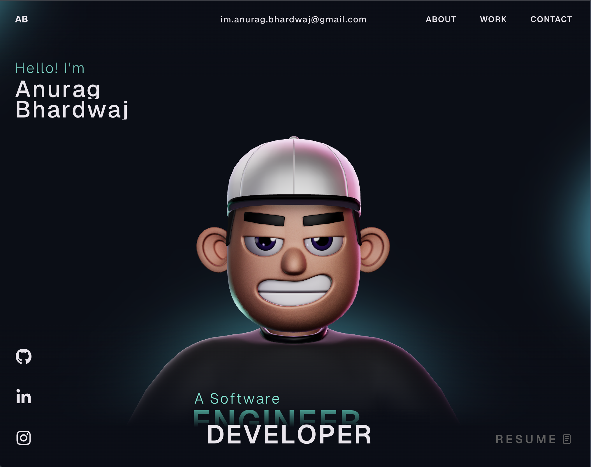

# 🚀 Anurag Bhardwaj — Portfolio Website

Welcome to the source code of my personal portfolio website — a modern, interactive, and performance-focused developer portfolio built to showcase my projects, skills, and creative frontend engineering work.

This portfolio highlights my work in frontend development, animations, 3D experiences, and modern web technologies.

---

## ✨ Features

* ⚡ Smooth and immersive UI animations using GSAP
* 🎨 Interactive 3D visuals powered by Three.js & WebGL
* 📱 Fully responsive across devices
* 🚀 Optimized performance and clean architecture
* 🧩 Reusable and scalable component structure
* 🌙 Modern developer-focused design

---

## 🛠️ Tech Stack

* **React.js**
* **TypeScript**
* **GSAP**
* **Three.js**
* **WebGL**
* **HTML5**
* **CSS3**
* **JavaScript**

---

## 📸 Preview



---

## ⚙️ Getting Started

Clone the repository and install dependencies:

```bash
git clone https://github.com/ianuragab/Portfolio-Site.git
cd Portfolio-Site
npm install
```

Run the development server:

```bash
npm run dev
```

Build for production:

```bash
npm run build
```

---

## 📌 GSAP Club Plugins Notice

This project currently uses modified/trial versions of GSAP Club plugins for development purposes.

⚠️ Trial plugins are **not allowed for production hosting or deployment**.

To use the project commercially or deploy it publicly, you must install the official GSAP Club plugins.

Learn more here:
👉 [https://gsap.com/docs/v3/Installation/](https://gsap.com/docs/v3/Installation/)

---

## 🌐 Live Demo

Add your deployed portfolio link here:

```bash
https://your-portfolio-link.com
```

---

## 🤝 Contributing

Contributions, suggestions, and feedback are always welcome.

If you'd like to improve something, feel free to fork the repository and create a pull request.

---


## 💫 Connect With Me

* LinkedIn: [http://linkedin.com/in/ianuragab](http://linkedin.com/in/ianuragab)
* Portfolio: [https://portfolio-site-two-indol.vercel.app/](https://portfolio-site-two-indol.vercel.app/)
* Email: im.anurag.bhardwaj@gmail.com

---

⭐ If you liked this project, consider giving it a star on GitHub!
